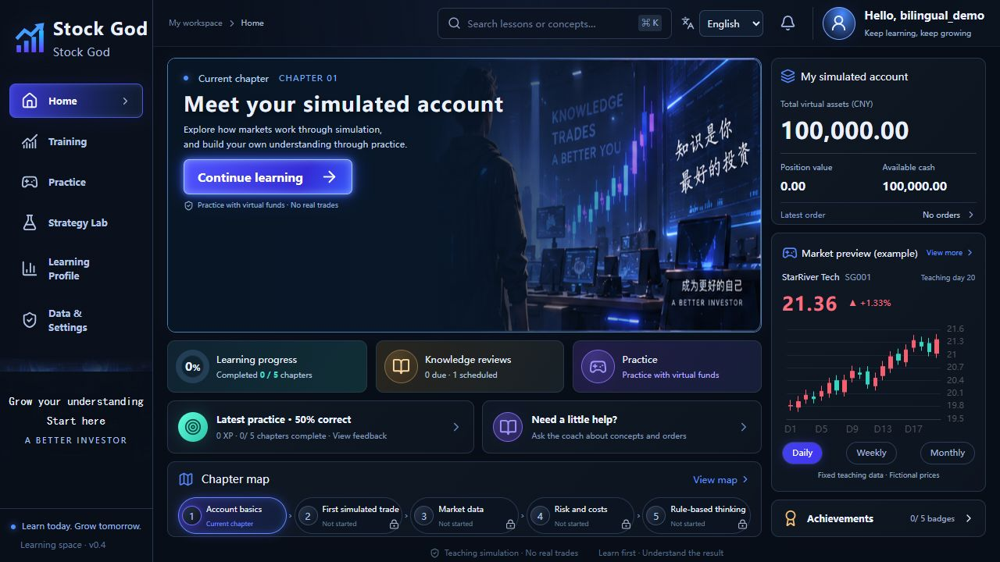
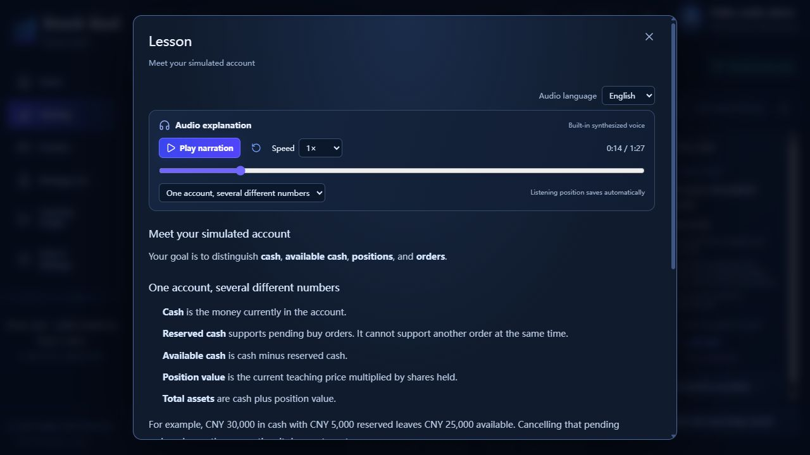
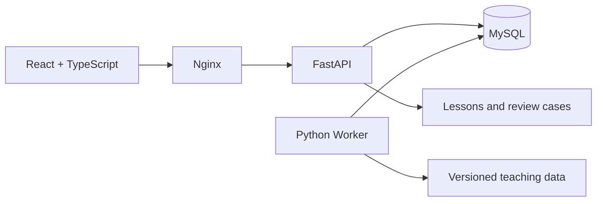

<div align="center">


# Stock God

**Learn the market. Practice with purpose. Build understanding.**

A self-hosted learning app for stock-market fundamentals and introductory quantitative research.<br>
Lessons, simulated trades, and spaced reviews — all in your browser.

<p>
  
  
  
  
  
</p>

**English** · [Chinese](README_CN.md)

[Preview](#preview) · [Features](#features) · [Quick start](#quick-start) · [Development](#development) · [Roadmap](#roadmap)

</div>

---

> **Simulation only.** Stock God uses virtual funds and teaching data. It does not connect to a brokerage or place real trades. Progress rewards understanding, rather than investment returns.

## Preview



<sub>Actual application screenshot using an isolated demo account. The interface, five courses, quizzes, reviews, and system feedback are available in English and Simplified Chinese. Reference artwork retains its original lettering.</sub>

<details>
<summary><strong>Spoken lesson preview</strong></summary>



</details>

## Why Stock God?

Learning to trade involves more than watching a price chart. Stock God connects each concept to a small, explainable practice task:

**Explore a concept → Try a simulation → Answer independently → Understand the feedback → Review with a new case**

You can follow a five-chapter path, inspect what happened to an order, and return to the concepts that need more practice. A profitable simulation is not a requirement for completing a lesson.

## Features

| | What you can do |
| :--- | :--- |
| **Personal learning space** | Register, sign in, and keep your own progress, orders, experiments, and reflections in MySQL. |
| **Two languages** | Switch between English and Simplified Chinese from the sign-in page or toolbar. Signed-in preferences follow your account. |
| **Guided first visit** | Follow a four-step introduction. Skip it, resume it later, or reopen it from the account menu. |
| **Five learning chapters** | Explore accounts, orders, market data, risk and costs, and rule-based strategies. Complete independent quizzes to unlock chapters and earn one-time badges. |
| **Spoken explanations** | Listen to all five lessons and preset coach answers in English or Simplified Chinese. Pause, change speed, jump between sections, and resume from a saved position. Thirty MP3 tracks are bundled; no speech API key is required. |
| **Knowledge reviews** | Practice 10 knowledge points through 20 alternative cases. Mistakes enter your personal queue; successful reviews schedule follow-ups after 1, 3, and 7 days. |
| **Simulated trading** | Use separate tutorial and free-practice accounts, each starting with 100,000 virtual CNY. Place limit orders, cancel pending orders, inspect fees, positions, and the cash ledger. |
| **Strategy experiments** | Run a moving-average strategy on a fixed 60-day teaching dataset. Inspect equity, a benchmark, drawdown, fees, and versioned parameters. Compare two or three completed runs over a common period. |
| **A compact workspace** | Keep charts and tasks visible on desktop. Open lessons, quizzes, trade records, and reviews in dialogs. Smaller screens scroll within the content area. |
| **Records you can inspect** | Save plans and reflections, export your own business records, and check database, worker, and data availability. |

### New in 0.5

- Course explanations and preset coach answers now include built-in synthesized audio in both languages.
- Playback includes pause/resume, restart, a seek bar, section navigation, and speeds from 0.75× to 2×. Audio starts only when you press play.
- Listening positions and speed are saved separately for each account, course, and language. Open **Learning Profile → My listening history** to continue.
- Closing an explanation stops its audio. Listening does not grant XP or bypass independent practice.

## Quick start

**Requirements:** Git and Docker with Compose. On Windows, use Docker Desktop in Linux container mode. The first build requires an internet connection.

```sh
git clone https://github.com/alexnirvana/StockGod.git
cd StockGod
```

Create your configuration **once**:

| Shell | Command |
| :--- | :--- |
| PowerShell | `Copy-Item .env.example .env` |
| macOS / Linux | `cp .env.example .env` |

Review `.env`, then start the application:

```sh
docker compose up -d --build
```

Open **[http://127.0.0.1:8080](http://127.0.0.1:8080)** and create an account.

1. Choose a username with 3–32 letters, digits, or underscores, and a password with 10–128 characters.
2. Follow the first-visit guide and begin the account chapter.
3. Open **Lesson** and press **Play narration** to listen, or read at your own pace.
4. Complete the independent quiz. Open the review card or reminder bell to revisit mistakes.
5. Continue to trading practice and inspect the outcome of each simulated order.

There is no shared default account. Usernames are case-insensitive. Once the local services are running, the included lessons and teaching simulations do not require an external data or AI service.

<details>
<summary><strong>Start, stop, and update</strong></summary>

```sh
docker compose ps
docker compose logs --tail 100 api worker
docker compose stop
docker compose start
```

To rebuild after updating the source:

```sh
docker compose up -d --build
```

The API applies database migrations at startup. Back up before upgrading. Normal restarts and rebuilds preserve the MySQL volume; **`docker compose down -v` deletes volumes**.

</details>

## Architecture



| Layer | Stack |
| :--- | :--- |
| Interface | React 19, TypeScript, Vite, React Router, TanStack Query, i18next |
| UI and charts | Radix UI, Tailwind CSS, Motion, ECharts |
| API and persistence | FastAPI, SQLAlchemy, Alembic, MySQL 8.4 |
| Experiments | Python worker, APScheduler, Parquet, DuckDB |
| Deployment | Docker Compose with `web`, `api`, `worker`, and `mysql` |

Passwords are hashed with Argon2id. Revocable sessions use HttpOnly cookies, write requests validate CSRF tokens and origins, and records are scoped to the authenticated user. The default deployment exposes only the web entry point on the local machine.

## Development

Use **Python 3.12** and **Node.js 22**. Local development defaults to a separate SQLite database; Docker uses MySQL.

On Windows:

```powershell
.\scripts\start-dev.ps1 -Install
```

Open **[http://127.0.0.1:5173](http://127.0.0.1:5173)**. Omit `-Install` on subsequent runs. Press Ctrl+C to stop the development processes.

<details>
<summary><strong>Manual setup on macOS / Linux</strong></summary>

```sh
python3.12 -m venv .venv
. .venv/bin/activate
python -m pip install -r backend/requirements.lock
python -m pip install --no-deps -e backend
npm --prefix frontend ci
python -m alembic -c backend/alembic.ini upgrade head
```

Run these commands in separate terminals at the repository root, activating the virtual environment in the Python terminals:

```sh
python -m uvicorn stock_god.api.main:app --host 127.0.0.1 --port 8000
python -m stock_god.jobs.worker
npm --prefix frontend run dev
```

</details>

### Tests

With the virtual environment activated:

```sh
python -m pytest tests -q
npm --prefix frontend test
npm --prefix frontend run build
```

The test suite covers authentication, user isolation, order accounting, idempotency, recovery, review scheduling, language isolation, experiment comparison, audio access, listening bookmarks, and legacy migrations. MySQL tests require a dedicated `stockgod_tests` database. Browser scripts are in [tests/e2e](tests/e2e); setup and isolated test commands are in the [operations guide](guides/OPERATIONS.md).

### Translation contributions

For bundled speech assets, playback behavior, and rebuilding audio, see [narration](guides/NARRATION.md).

See the [internationalization guide](guides/I18N.md) for locale selection, resource files, canonical records, and translation checks.

### Repository layout

```text
StockGod/
├── frontend/           React application and UI assets
├── backend/            API, learning rules, trading engine, worker, migrations
├── content/            Markdown lessons, quiz catalog, review cases, scenarios
├── tests/              Unit, integration, and browser tests
├── scripts/            Development, backup, and migration tools
├── guides/             Public operations documentation
├── .github/assets/     README screenshots
├── compose.yaml        Local deployment
├── .env.example        Configuration template
└── data/               Local runtime data and backups; excluded from Git
```

## Roadmap

- [x] Personal accounts, MySQL persistence, and first-visit guidance
- [x] Five chapters, server-side grading, progression, and unique rewards
- [x] Tutorial and free-practice ledgers with order explanations
- [x] Per-knowledge mistake tracking and deterministic spaced reviews
- [x] Reproducible experiments on fixed teaching data
- [ ] Validated historical market data and historical challenges
- [ ] Daily forward simulation with data availability checks
- [x] Experiment comparisons over aligned common periods
- [ ] More lessons and review cases
- [ ] Optional AI explanations and introductory model-research courses
- [x] English and Simplified Chinese interface and course content
- [x] Built-in bilingual narration and personal listening bookmarks

Real market feeds, historical challenges, forward simulation, open-ended AI coaching, LightGBM training, email verification, and self-service password recovery are **not implemented**. The included coach provides preset teaching explanations.

## Contributing and operations

Issues and pull requests are welcome. Describe the learning problem, expected behavior, and how to verify the change. Keep calculation, grading, and reward rules on the server, preserve data ownership, and keep this project simulation-only.

For configuration, database backups, legacy account binding, and browser tests, see the [operations guide](guides/OPERATIONS.md). Dependency and asset acknowledgments are listed in [Third-party notices](THIRD_PARTY_NOTICES.md).

<div align="center">

**Small lessons. Explainable practice. Lasting understanding.**

[Back to top](#stock-god)

</div>
