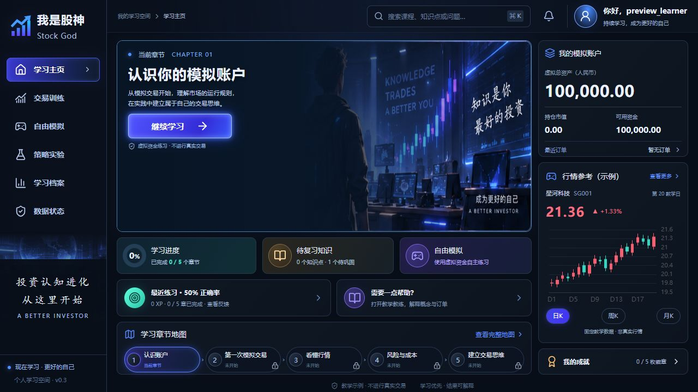
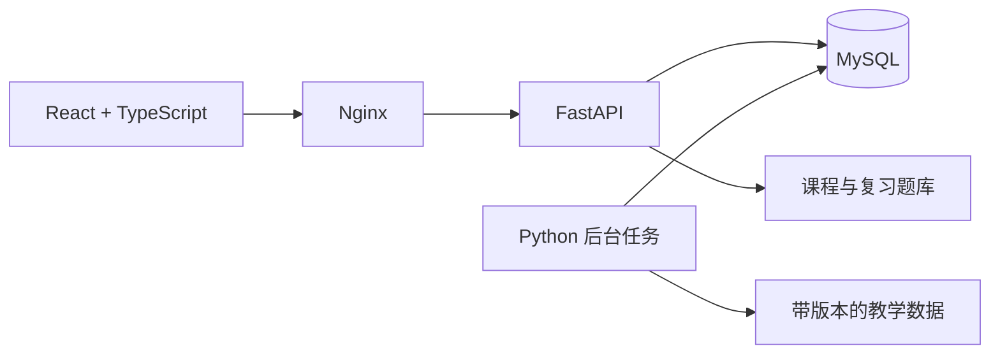

<div align="center">


# 我是股神 · Stock God

**理解市场，认真练习，让每一次学习都有收获。**

一个可自行部署的股票与量化入门学习应用。<br>
在浏览器里学习概念、练习模拟交易，并通过间隔复习巩固理解。

<p>
  
  
  
  
  
</p>

[English](README.md) · **简体中文**

[界面预览](#界面预览) · [主要功能](#主要功能) · [快速开始](#快速开始) · [本机开发](#本机开发) · [开发路线](#开发路线)

</div>

---

> **仅用于教学模拟。** 程序使用虚拟资金与教学数据，不连接券商，不进行真实交易。学习进度由理解与练习决定，不以投资收益作为通关条件。

## 界面预览



<sub>来自实际运行程序的截图，使用独立演示账号。当前应用界面与课程内容为简体中文；项目说明提供独立的英文版和中文版。</sub>

## 为什么做这个项目？

学习股票不只是盯着价格曲线。每个概念都应该对应一次能解释清楚的练习：

**认识概念 → 动手模拟 → 独立作答 → 理解反馈 → 换案例复习**

你可以沿着五章课程循序学习，查看每一笔订单发生了什么，再回到需要巩固的知识点。一次模拟盈利不是理解正确的证明，模拟亏损也不会自动导致课程失败。

## 主要功能

| | 你可以做什么 |
| :--- | :--- |
| **个人学习空间** | 注册、登录，在 MySQL 中独立保存自己的进度、订单、实验与复盘。 |
| **首次使用引导** | 跟随四步引导认识界面；支持跳过、恢复进度，也能从账号菜单重新查看。 |
| **五章学习路线** | 学习账户、订单、行情、风险与成本、规则策略；通过独立练习解锁章节，获得一次性经验与徽章。 |
| **知识点复习** | 10 个知识点、20 道替换案例。错题进入个人队列，答对后按 1、3、7 天安排巩固。 |
| **模拟交易** | 教学与自由模拟账户各有 100,000 元虚拟初始资金。支持限价委托、撤单、费用、持仓与资金流水查询。 |
| **策略实验** | 在固定 60 日教学数据上运行双均线策略，查看净值、基准、回撤、费用和参数版本。 |
| **紧凑工作区** | 电脑端保持图表与任务可见，讲解、测验、交易记录和复习按需弹窗；小屏幕允许内容区滚动。 |
| **可查看的学习记录** | 保存计划与复盘，导出个人业务记录，查看数据库、后台任务与数据状态。 |

### 0.3 版本新增

- 错题精确记录到知识点，复习使用不同于原始测验的新案例。
- 复习按真实经过的时间安排，与模拟交易时钟独立；连续完成四次安排的复习后结束本轮巩固。
- 答错会重新开始巩固，不重复发放课程经验或徽章。
- 复习队列与作答记录随账号保存，支持退出后恢复，并保护并发和重复提交。
- 升级时迁移旧版尚未解决的错题，保留原有课程进度。

## 快速开始

**准备环境：** Git、Docker 与 Compose。Windows 使用 Docker Desktop 的 Linux 容器模式。首次构建需要联网。

```sh
git clone https://github.com/alexnirvana/StockGod.git
cd StockGod
```

首次运行时复制配置文件，已有 `.env` 时请保留：

| 终端 | 命令 |
| :--- | :--- |
| PowerShell | `Copy-Item .env.example .env` |
| macOS / Linux | `cp .env.example .env` |

检查 `.env` 配置，然后启动：

```sh
docker compose up -d --build
```

打开 **[http://127.0.0.1:8080](http://127.0.0.1:8080)**，注册自己的账号。

1. 用户名使用 3–32 位字母、数字或下划线，密码长度为 10–128 位。
2. 完成首次使用引导，从认识账户开始学习。
3. 提交独立练习，通过首页复习卡片或右上角提醒查看错题。
4. 继续模拟交易，检查每张订单的处理结果。

没有共享默认账号，用户名不区分大小写。本地服务启动后，内置课程与教学模拟不依赖外部行情或 AI 服务。

<details>
<summary><strong>启动、停止与更新</strong></summary>

```sh
docker compose ps
docker compose logs --tail 100 api worker
docker compose stop
docker compose start
```

更新代码后重新构建：

```sh
docker compose up -d --build
```

API 启动时自动执行数据库迁移，升级前请先备份。普通停止、重启和重建会保留 MySQL 数据卷；**`docker compose down -v` 会删除数据卷**。

</details>

## 系统架构



| 层次 | 技术 |
| :--- | :--- |
| 界面 | React 19、TypeScript、Vite、React Router、TanStack Query |
| 组件与图表 | Radix UI、Tailwind CSS、Motion、ECharts |
| 接口与持久化 | FastAPI、SQLAlchemy、Alembic、MySQL 8.4 |
| 策略实验 | Python Worker、APScheduler、Parquet、DuckDB |
| 部署 | Docker Compose：`web`、`api`、`worker`、`mysql` |

密码采用 Argon2id 哈希；可撤销会话通过 HttpOnly Cookie 保存，写操作验证 CSRF 和来源，业务记录限定当前登录用户。默认部署只向本机开放 Web 入口。

## 本机开发

使用 **Python 3.12** 与 **Node.js 22**。本机开发默认使用独立 SQLite 数据库，Docker 使用 MySQL。

Windows：

```powershell
.\scripts\start-dev.ps1 -Install
```

打开 **[http://127.0.0.1:5173](http://127.0.0.1:5173)**。后续可省略 `-Install`，Ctrl+C 停止开发进程。

<details>
<summary><strong>macOS / Linux 手动启动</strong></summary>

```sh
python3.12 -m venv .venv
. .venv/bin/activate
python -m pip install -r backend/requirements.lock
python -m pip install --no-deps -e backend
npm --prefix frontend ci
python -m alembic -c backend/alembic.ini upgrade head
```

在项目根目录打开三个终端分别执行，Python 终端需激活虚拟环境：

```sh
python -m uvicorn stock_god.api.main:app --host 127.0.0.1 --port 8000
python -m stock_god.jobs.worker
npm --prefix frontend run dev
```

</details>

### 测试

激活虚拟环境后：

```sh
python -m pytest tests -q
npm --prefix frontend test
npm --prefix frontend run build
```

测试覆盖账号认证、用户隔离、模拟账本、幂等、恢复、复习时间安排与旧版迁移。MySQL 回归必须使用专用 `stockgod_tests` 数据库。浏览器脚本位于 [tests/e2e](tests/e2e)，隔离环境和执行方式见[运维说明](guides/OPERATIONS_CN.md)。

### 目录结构

```text
StockGod/
├── frontend/           React 应用与界面资源
├── backend/            接口、学习判定、交易引擎、后台任务与迁移
├── content/            Markdown 课程、测验目录、复习题库与教学场景
├── tests/              单元、集成与浏览器测试
├── scripts/            开发、备份与迁移工具
├── guides/             公开运维文档
├── .github/assets/     README 界面截图
├── compose.yaml        本地部署
├── .env.example        配置模板
└── data/               本地运行数据与备份，不提交 Git
```

## 开发路线

- [x] 个人账号、MySQL 持久化与首次使用引导
- [x] 五章课程、后端判分、前置解锁与唯一奖励
- [x] 教学和自由模拟账本，以及订单原因说明
- [x] 知识点错题记录与确定规则的间隔复习
- [x] 固定教学数据上的可复现策略实验
- [ ] 经核验的历史行情数据与历史闯关
- [ ] 带数据可用性检查的日线前向模拟
- [ ] 更多课程、复习案例与实验对比
- [ ] 可选 AI 讲解与模型研究入门课程
- [ ] 英文应用界面与课程翻译

真实行情、历史闯关、前向模拟、开放式 AI 教练、LightGBM 训练、邮箱验证和自助找回密码**尚未实现**。当前教练提供预设教学讲解。

## 参与开发与运维

欢迎提交问题和改进。请说明要解决的学习问题、预期行为与验证方法。金额计算、判分和奖励规则保留在后端，维护用户数据隔离，并保持仅教学模拟的边界。

配置、数据库备份、旧版账号绑定和浏览器测试见[运维说明](guides/OPERATIONS_CN.md)。依赖与界面素材说明见[第三方声明](THIRD_PARTY_NOTICES.md)。

<div align="center">

**小步学习，理解原因，让知识留得更久。**

[回到顶部](#我是股神--stock-god)

</div>
